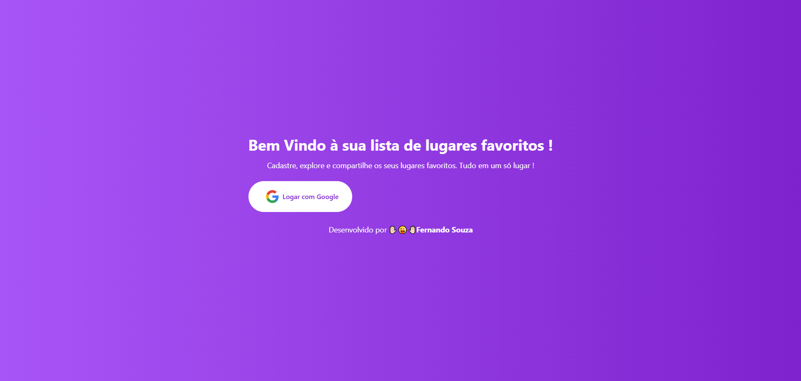
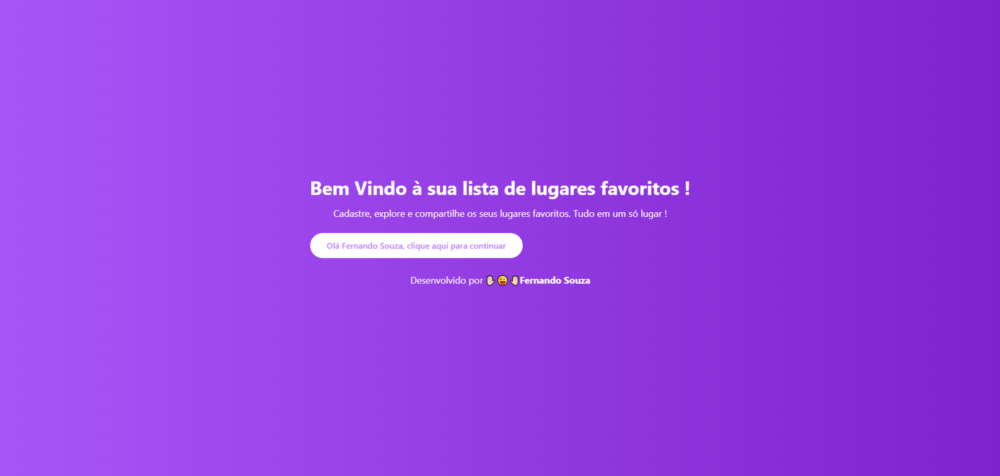
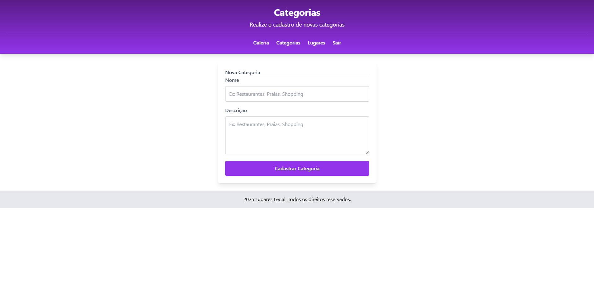
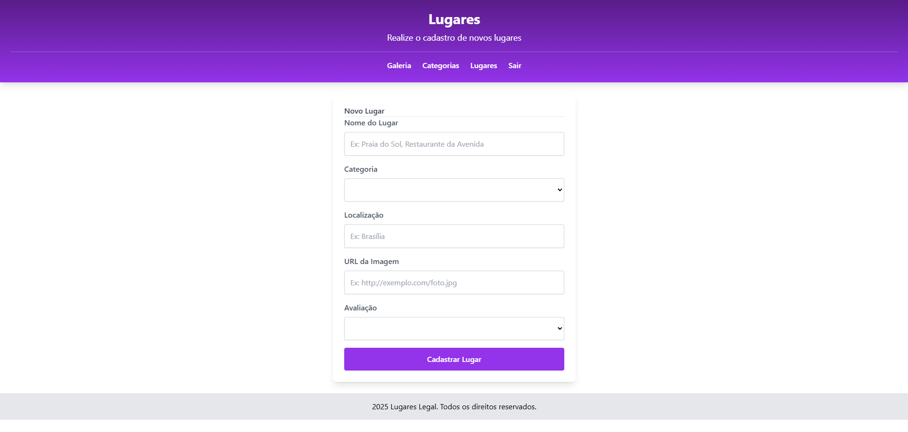
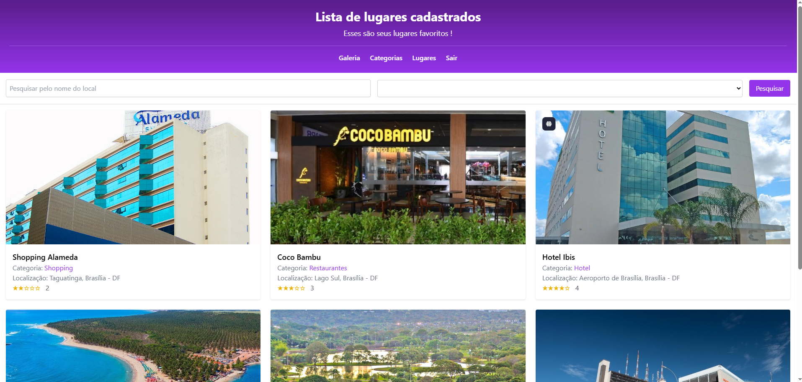

# 📌 Lugares Favoritos - Angular

## 🚀 Sobre o Projeto

Este é um projeto desenvolvido durante o curso de Angular 19 na Udmey, buscando aprimorar as minhas habilidades nesse poderoso framework juntamente com uma estilização aprimorada. O projeto permite **logar com Google**, cadastrar **categorias** para os lugares, cadastrar os **lugares** e visualizar os lugares cadastrados.

---

## 🎯 Funcionalidades Principais

✅ **Logar com Google**.
✅ **Cadastrar categorias**.
✅ **Cadastrar lugares**.
✅ **Visualizar os lugares**.

## 🛠️ Tecnologias Utilizadas

🔹 **AngularJS**

🔹 **Tailwind CSS**

🔹 **NodeJS**

🔹 **Docker**

---

## 🖥️ Interface da Aplicação

### **Tela Antes de Logar**


### **Tela Após Logar**


### **Tela Cadastro de Categorias**


### **Tela Cadastro de Categorias**


### **Galeria**


---

## 🔧 Como Executar o Projeto

Clone este repositório:
```bash
 git clone https://github.com/Fernando32117/Lugares-Favoritos-Angular.git
```

Acesse a pasta do projeto:
```bash
 cd Lugares-Favoritos-Angular
 npm install
```

Execute a api dentro da pasta api do projeto:
```bash
 npm run server
```
- O backend rodará na porta `3000`.

Execute o front na pasta raiz do projeto:
```bash
 ng serve
```
- Abra o navegador e acesse `http://localhost:4200` onde a aplicação estará rodando.

---

## 📩 Contato

Se tiver alguma sugestão ou dúvida, sinta-se à vontade para entrar em contato:

📧 **Email:** [Gmail](nando32117@gmail.com)
💼 **LinkedIn:** [Fernando Souza](https://www.linkedin.com/in/gerfernandosouza/)

Se este projeto foi útil para você, deixe uma ⭐ e contribua com melhorias! 🚀

---